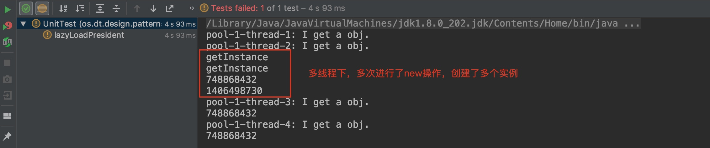
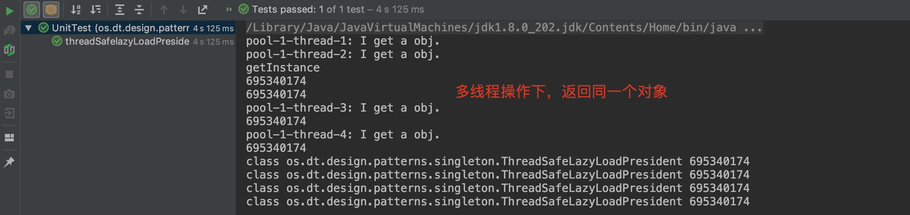

## 单例模式简介
### 定义
保证一个类仅有一个实例，并提供一个访问它的全局访问入口。（你是我的唯一～～）
### 为什么要用单例模式呢？
&emsp;&emsp;其实生活中很多地方可以反应单例模式：比如一个国家只有一个总统；你正常合法的老婆只能有一个，别人叫你老婆时必须只能是同一个人（排除违法搞多个）。

&emsp;&emsp;在软件系统中，有一些对象其实我们只需要一个比如：线程池、缓存、注册表、日志对象、充当打印机、显卡等设备驱动程序的对象等。事实上，这一类对象也只能有一个实例，如果制造出多个实例就可能会导致一些问题的产生，比如：程序的行为异常、资源使用过量、或者不一致性的结果等。

&emsp;&emsp;一个简单场景就是：我们的应用程序有一些配置文件，我们希望只在系统启动的时候读取这些配置文件，并将这些配置保存在内存中，以后在程序中使用这些配置文件信息的时候不必再重新读取。这时候就需要使用单例模式。

&emsp;&emsp;一般在下面两种场景下会考虑使用单例模式：
1. 产生某对象会消耗过多的资源，为避免频繁地创建与销毁对象对资源的浪费。如：
> 对数据库的操作、访问 IO、线程池（threadpool）、网络请求等。
2. 某种类型的对象应该有且只有一个。如果制造出多个这样的实例会使程序异常。如：
> 一个系统只能有：一个窗口管理器或文件系统，计时工具或 ID（序号）生成器，缓存（cache），处理偏好设置和注册表（registry）的对象，日志对象。

&emsp;&emsp;简单来说使用单例模式可以带来下面几个好处：
1. 对于频繁使用的对象，可以节省创建对象所花费的时间，这对于那些重量级对象而言，是非常可观的一笔系统开销；
2. 由于new操作的次数减少，因而对系统内存的使用频率也会降低，这将减轻 GC 压力，缩短 GC 停顿时间。

## 实现方式
&emsp;&emsp;单例模式，按加载时机可以分为：饿汉方式和懒汉方式；按实现的方式，有：双重检查加锁，内部类方式和枚举方式等等。它们有的效率很高，有的节省内存，有的实现得简单漂亮，还有的存在严重缺陷，大部分使用的时候都有限制条件。下面我们来分析下各种写法的区别，辨别哪些是不可行的，哪些是推荐的，最后为大家筛选出几个值得我们适时应用到项目中的实现方式。

### 饿汉模式
&emsp;&emsp;所谓饿汉模式就是指全局的单例实例在类装载时构建。举个生活例子：妈妈早上起来为我们做饭吃，饭快做好的时候，一般都会叫我们起床吃饭，这是日常情况。如果饭还没有好的时候，我们就自己起来了（这时候妈妈还没有叫我们起床），这种情况在单例模式中称之为饿汉式，也就是说妈妈还没有叫我们起床，我们自己就起来的，就是外部还没有调用自己，自己的实例就已经创建好了。

<details>
```java
public class HungryPresident {

    private static final HungryPresident INSTANCE = new HungryPresident();

    // 私有化构造方法
    private HungryPresident(){

    }

    public static HungryPresident getInstance() {
        System.out.println("getInstance");
        return INSTANCE;
    }
}
```
**优缺点：**
1. 简单实用，比较推荐。
2. 类加载到内存后，只实例化一个实例，JVM保证线程安全，不用同步，运行效率高。
3. 实例不管后续有没有使用，类加载完就完成实例化，外部一直没有调用该实例，那么这部分的系统资源的消耗是没有意义的。但话说如果这个类不用的话，你也没必要加载呀。

> 代码测试验证：
> 

### 懒汉模式
&emsp;&emsp;所谓的懒汉模式，就是一开始并不实例化对象，等到需要使用的时候才实例化。还是上面的例子，如果饭做好了，妈妈叫我们起床之后，我们才慢吞吞的起床，这种情况在单例模式中称之为懒汉式（饭都做好了，妈妈叫你起床之后，自己才起的，能不懒汉吗？就是外部对该类的方法发出调用之后，该实例才建立的）。
<details>
```java
public class LazyLoadPresident {

    private static LazyLoadPresident INSTANCE;

    private LazyLoadPresident() {

    }

    public static LazyLoadPresident getInstance() {

        if (INSTANCE == null) {
            System.out.println("getInstance");
            INSTANCE = new LazyLoadPresident();
        }

        return INSTANCE;
    }
}
```
**优缺点：**
1. 实例在被使用的时候才被创建，可以节省系统资源，体现了延迟加载的思想。
2. 多线程下，实例不能保证只有一个，线程不安全。

> 代码测试验证：
> 

<font color=red>那如何将懒汉式单例在多线程下正确的发挥作用呢？</font>

可以在访问单例实例的方法处进行同步：
<details>
```java
public class ThreadSafeLazyLoadPresident {

    private static ThreadSafeLazyLoadPresident INSTANCE;

    private ThreadSafeLazyLoadPresident() {

    }

    public static synchronized ThreadSafeLazyLoadPresident getInstance() {
        if (INSTANCE == null) {
            System.out.println("getInstance");
            INSTANCE = new ThreadSafeLazyLoadPresident();
        }
        return INSTANCE;
    }
}
```
**优缺点：**
1. 可以正确按需返回单例对象，线程安全
2. 每次获取对象都得加锁，在频繁获取对象操作下，效率太低

> 代码测试验证：
> 

### 双重检查加锁式
&emsp;&emsp;上面懒汉模式直接在整个方法用了synchronized关键字进行方法同步，锁的粒度太大。双重校验方式就是为了解决懒汉模式的线程安全和效率问题而产生的。
<details>
```java
public class ThreadSafeDoubleCheckPresident {

    // 必须加volatile
    private static volatile ThreadSafeDoubleCheckPresident INSTANCE;

    private ThreadSafeDoubleCheckPresident() {

    }

    public static ThreadSafeDoubleCheckPresident getInstance() {
        if (INSTANCE == null) {  // 这层判断是有必要的 大多数情况下INSTANCE不为null直接返回了，减少了加锁的操作
            System.out.println("getInstance");
            synchronized (ThreadSafeDoubleCheckPresident.class) {
                if (INSTANCE == null) {
                    INSTANCE = new ThreadSafeDoubleCheckPresident();
                }
            }
        }

        return INSTANCE;
    }

}
```
> 注：
> 下面解释一下为啥 instance 变量要声明成 volatile
> 原因是instance = new ThreadSafeDoubleCheckPresident() 这一行代码并不是原子性的，具体来说，JVM执行这一行代码时主要做了三件事：
> 1.给 instance 分配内存空间
> 2.调用 ThreadSafeDoubleCheckPresident 的构造函数来初始化成员变量
> 3.将 instance 变量指向分配的内存空间（执行完这一步之后 instance 就不为 null 了）
> 由于 JVM 的指令优化存在，上面的第二点和第三点并不能保证一定按顺序执行。也就是说执行顺序有可能为 1-2-3 或者 1-3-2
> 假设是 1-3-2，那么如果执行到3的时候，线程被抢占了，有另外一个线程获取了单例对象（这时候 instance 不为 null，但是还没有初始化），那么自然就会出现错误。
> 为了解决这个问题，我们只要将 instance 变量声明成 volatile 就可以了。
> volatile 关键字主要有两个特性：
> 1.可见性：保证线程没有变量的本地副本，每次都去主内存获取最新版本
> 2.禁止指令重排序：生成内存屏障
> 很明显，我们这里利用的是 volatile 的第二个特性。
> 特别注意的是只有在 Java 5 之后使用这种方式才是完全安全的，原因是 Java 5 之前的 Java 内存模型（Java Memory Model，JMM）存在缺陷，即使变量声明为 volatile 也不能完全避免重排序，这个问题在 Java 5 之后才修复。

**优缺点：**
1. 可以正确按需返回单例对象，线程安全
2. 不够简洁，不好理解

### 静态内部类式
&emsp;&emsp;静态内部实现的单例是懒加载的且线程安全。根据JVM的类加载规则，静态内部类只有在主动调用的时候才会加载。也就是说，在第一次调用 getInstance() 方法时才会加载 SingletonHolder 类，同时创建了 INSTANCE 对象。
<details>
```java
public class InitializingOnDemandHolderPresident {

    private InitializingOnDemandHolderPresident(){

    }

    // 可以做到延迟加载
    private static class SingletonHolder {
        private static final InitializingOnDemandHolderPresident INSTANCE =
                new InitializingOnDemandHolderPresident();
    }

    public static InitializingOnDemandHolderPresident getInstance() {
        return SingletonHolder.INSTANCE;
    }

}
```
**优缺点：**
1. 懒加载的且线程安全，解决占用内存问题
2. 无法阻止反射、序列化攻击

### 枚举类式
&emsp;&emsp;这种实现方式没有被广泛采用，但这是实现单例模式的最佳方法。 它更简洁，自动支持序列化机制，绝对防止多次实例化。其实上面所说的实现方式都存在缺陷，就是无法阻止通过反射、序列化的方式创建出多个实例，只有枚举这种形式可以做到。
<details>
```java
public enum  EnumPresident {
    INSTANCE;

    public void run(){
        System.out.println("EnumPresident run ...");
    }

}
```
**优缺点：**
1. 简洁、线程安全、绝对单例
2. 把一个类定义成枚举形式上有点别扭

## 总结
文章主要介绍到了以下几种方式实现单例模式：
- 饿汉式(线程安全）
- 懒汉式（非线程安全和synchronized关键字线程安全版本)
- 懒汉式(双重检查加锁版本)
- 懒汉式（静态内部类方式）
- 饿汉式（枚举方式）

JDK中也有相同方式的单例实现类如：
- java.lang.Runtime.getRuntime()
- java.awt.Desktop.getDesktop()
- java.lang.System.getSecurityManager()

每种方式都存在优缺点，值得一说的是，绝大部分场景中直接使用第一种饿汉式就可以，它足够简单，也能保证线程安全，只要你可以容忍它在第一次创建所消耗的系统资源。
> 源码地址：https://github.com/bebee4java/java-design-patterns/tree/master/singleton
