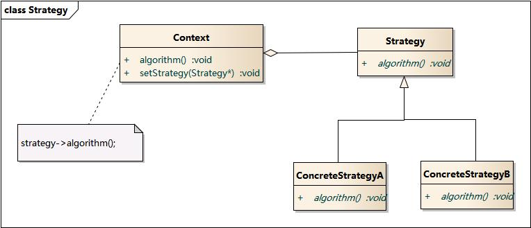

## 策略模式简介
### 定义
> Define a family of algorithms, encapsulate each one, and make them interchangeable. [The] Strategy [pattern] lets the algorithm vary independently from clients that use it.

策略模式定义了一组算法，将它们逐个封装起来，并使它们可以相互替换。策略可以让算法独立于使用它们的客户而变化。

### 模式结构
策略模式包含如下角色：
- Context：上下文类，持有具体策略类的实例，并负责调用相关的算法
- Strategy：策略接口或者策略抽象类
- ConcreateStrategyA等：实现策略接口的具体策略类

类图：

时序图：


### 使用场景
在以下情况下可以使用策略模式：

- 如果在一个系统里面有许多类，它们之间的区别仅在于它们的行为，那么使用策略模式可以动态地让一个对象在许多行为中选择一种行为。
- 一个系统需要动态地在几种算法中选择一种。
- 如果一个对象有很多的行为，如果不用恰当的模式，这些行为就只好使用多重的条件选择语句来实现。
- 不希望客户端知道复杂的、与算法相关的数据结构，在具体策略类中封装算法和相关的数据结构，提高算法的保密性与安全性。

## 实践一下
上面分析了策略模式的结构和概念，介绍了使用的场景。不过光看这些概念还是有些空洞，不好理具体的实现逻辑。下面我将以具体的实例来说明，加深大家对策略模式的理解。

紧张的期末考试结束了，班主任想看下同学们的语文成绩的排名情况，如果让你来实现这个需求会怎么做呢？很自然的首先我们需要定义学生这个对象，包含学号、语文成绩等等属性，那要怎么对Student对象进行排序呢？我们知道Java对象要想进行大小比较，可以实现Comparable接口，实现里面的compareTo方法，这样就可以对两个学生对象进行比较了。于是学生类可以这么实现：
```java
public class Student implements Comparable<Student> {
    // 学号
    int sid;
    // 语文成绩
    int chinese;
    // 数学成绩
    int math;

    public Student(int sid, int chinese, int math) {
        this.sid = sid;
        this.chinese = chinese;
        this.math = math;
    }
    public int compareTo(Student o) {
        if (this.chinese > o.chinese) return 1;
        else if (this.chinese < o.chinese) return -1;
        else return 0;
    }
    @Override
    public String toString() {
        return "{sid:"+sid+",chinese:"+chinese+",math:"+math+"}";
    }
}
```
定义好学生对象后，我们就可以实现一个Sorter，对学生对象进行排序了，sort方法(V1)可以这么做（这里可以忽略排序的算法，重点是在说明策略模式）：
```java
// 只能对student进行排序
    public void sort_v1(Student[] arr) {
        for (int i=0; i<arr.length-1; i++){
            int minPos = i;
            for (int j=i+1; j<arr.length; j++){
                minPos = arr[j].compareTo(arr[minPos]) == -1 ? j : minPos;
            }
            swap(arr, i, minPos);
        }
    }
    void swap(Student[] arr, int i, int j) {
        Student temp = arr[i];
        arr[i] = arr[j];
        arr[j] = temp;
    }
```
我们对上面功能进行测试：
```java
public class SortApp {
    public static void main(String[] args) {
       Student[] arr = {new Student(1, 90, 100),
               new Student(2, 80, 89),
               new Student(3, 91, 90)
       };

       Sorter sorter = new Sorter();
       sorter.sort(arr);
       System.out.println(Arrays.toString(arr));
    }
}
```
执行代码，输出下面结果：
```java
[{sid:2,chinese:80,math:89}, {sid:1,chinese:90,math:100}, {sid:3,chinese:91,math:90}]
```
可以看到Student已经按照chinese成绩进行升序排列了，很好到此已经完全实现了班主任交给你的需求了。
第二天，班主任又找到了你说，想了解一下自己班级在整个年级的语文成绩排名情况。对于班级如何衡量语文成绩的水平呢？我们可以采用语文成绩的平均分进行排序。由上面的经验，先定义Class对象，包含班级编号、语文成绩等等属性：
```java
public class Class implements Comparable<Class> {
    // 班级编号
    int cid;
    // 语文平均成绩
    int chinese;
    // 数学平成绩
    int math;

    public Class(int cid, int chinese, int math) {
        this.cid = cid;
        this.chinese = chinese;
        this.math = math;
    }
    public int compareTo(Class o) {
        if (this.chinese > o.chinese) return 1;
        else if (this.chinese < o.chinese) return -1;
        else return 0;
    }
    @Override
    public String toString() {
        return "{cid:"+cid+",chinese:"+chinese+",math:"+math+"}";
    }
}
```
为了能复用之前的Sorter我们对sort方法进行改造，让其既能对Student排序，也能对Class排序：
```java
// 能对所有的Comparable对象进行排序, 但是比较方法不能修改
    public void sort(Comparable[] arr) {
        for (int i=0; i<arr.length-1; i++){
            int minPos = i;
            for (int j=i+1; j<arr.length; j++){
                minPos = arr[j].compareTo(arr[minPos]) == -1 ? j : minPos;
            }
            swap(arr, i, minPos);
        }
    }
    void swap(Comparable[] arr, int i, int j) {
        Comparable temp = arr[i];
        arr[i] = arr[j];
        arr[j] = temp;
    }
```
很好，此时的Sorter可以对任意可比较的对象（实现了Comparable接口）进行排序了。

到这Sorter已经完美了嘛？聪明的你应该已经发现了，学生不仅有语文成绩，还有数学成绩等等。如果班主任哪天想看一下学生的数学成绩排名怎么办？你可能想到的方式是把Student的compareTo方法重写一下啊，让它按照数学成绩进行比较。这确实能够实现，但是这种方式不是一种好的写法。因为班主任的想法可能经常会变，你不可能每次都来修改Student类，这不符合开闭原则。

好的做法是，我们可以定义几种比较的策略，每次可以根据班主任的要求来选择策略进行排序，而不是来修改Student对象。可以通过Java的Comparator接口来实现，所以最终的Sorter实现是：
```java
class Sorter<T> {
    public void sort(T[] arr, Comparator<T> comparator) {
        for (int i=0; i<arr.length-1; i++){
            int minPos = i;
            for (int j=i+1; j<arr.length; j++){
                minPos = comparator.compare(arr[j],arr[minPos]) == -1 ? j : minPos;
            }
            swap(arr, i, minPos);
        }
    }
    void swap(T[] arr, int i, int j) {
        T temp = arr[i];
        arr[i] = arr[j];
        arr[j] = temp;
    }
}
```
这样我们就可以对Student灵活的根据语文、数学成绩进行排序了：
```java
Student[] arr = {new Student(1, 90, 100),
                new Student(2, 80, 89),
                new Student(3, 91, 90)
        };
new Sorters<Student>().sort(arr, new Comparator<Student>() {
            public int compare(Student o1, Student o2) {
                if (o1.chinese > o2.chinese) return 1;
                else if (o1.chinese < o2.chinese) return -1;
                else return 0;
            }
        });
```
看到这你是否能想起来？哦！Java的Collections工具类的sort不就这么干的嘛。我们来看个例子：
```java
List<Integer> list = new ArrayList<Integer>();
list.add(3);list.add(1);list.add(2);
Collections.sort(list, new Comparator<Integer>() {
    public int compare(Integer o1, Integer o2) {
        if (o1 > o2) return 1;
        else if (o1 < o2) return -1;
        else return 0;
    }
});
System.out.println(list);
```
其实这就是采用了策略模式。

## 总结
策略模式提供了对“开闭原则”的完美支持，用户可以在不修改原有系统的基础上选择算法（策略），并且可以灵活地增加新的算法（策略）。可以避免使用多重条件转移语句。
不过缺点就是客户端必须知道所有的策略类，并自行决定使用哪一个策略类。为了更好的组织所有的策略我们可以通过枚举来扩展：
```java
enum StudentStrategyEnum {
    CHINESE {
        @Override
        public Comparator strategy(){
          return new Comparator<Student>(){
              public int compare (Student o1, Student o2){
                  if (o1.chinese > o2.chinese) return 1;
                  else if (o1.chinese < o2.chinese) return -1;
                  else return 0;
              }
          };
      }
    },

    MATH {
        @Override
        public Comparator strategy(){
            return new Comparator<Student>(){
                public int compare (Student o1, Student o2){
                    if (o1.math > o2.math) return 1;
                    else if (o1.math < o2.math) return -1;
                    else return 0;
                }
            };
        }
    };

    public abstract Comparator strategy();
}
```
我们就可以这么来选择排序策略：
```java
new Sorters<Student>().sort(arr, StudentStrategyEnum.MATH.strategy());
```
其实StudentStrategyEnumme枚举类本身也采用了策略模式。麻雀虽小，五脏俱全。策略模式的几个要素，在策略枚举里都能找到。首先是Strategy接口，这里由抽象的strategy方法充当。而ConcreteStrategy则由枚举值CHINESE、MATH充当。Context则是枚举类本身，通过枚举类选择不同的枚举值也就相当于选择不同的策略(算法)。

> 源码地址：https://github.com/bebee4java/java-design-patterns/tree/master/strategy