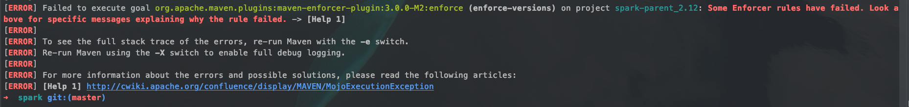
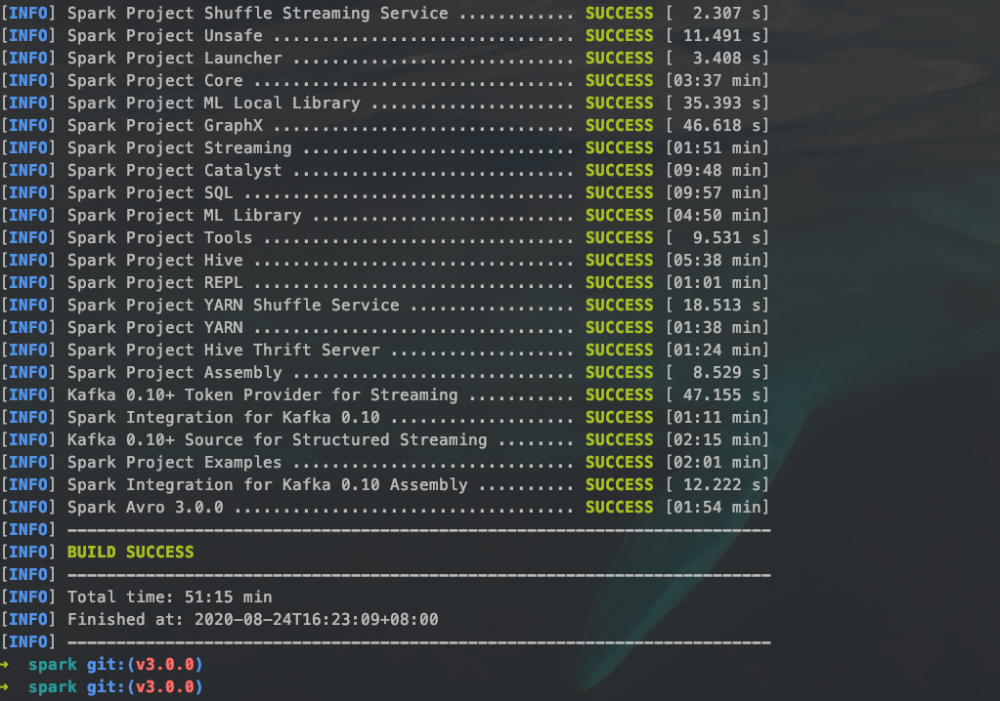
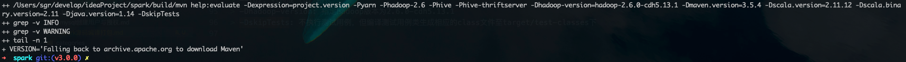
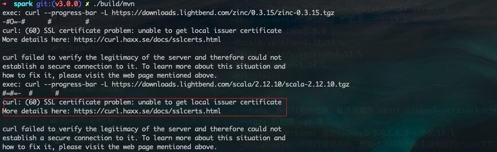
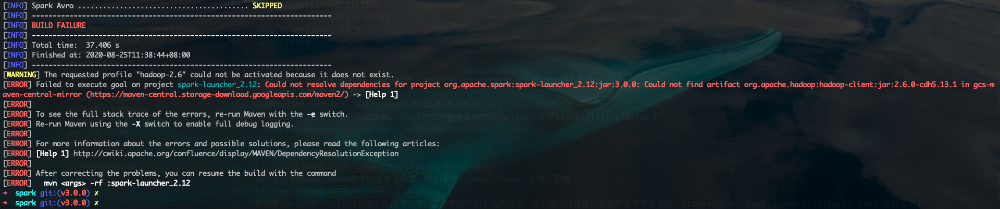
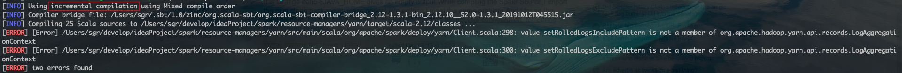

## spark源码编译

1. 获取spark源码
   - 从github上clone spark项目：`git clone https://github.com/apache/spark.git`
   - 将代码导入到Idea中
   - checkout指定版本的spark代码(3.0.0为例)：`git checkout -b v3.0.0 v3.0.0`
2. mvn打包
   - 指定mvn坏境配置：`export MAVEN_OPTS="-Xmx2g -XX:MaxPermSize=512M -XX:ReservedCodeCacheSize=512m"`
   - 指定需要的profile进行打包：`mvn clean package -Phadoop-2.7 -Dhadoop.version=2.7.4 -Phive -Phive-thriftserver -Pyarn -DskipTests`
     > 注意：由于编译过程Maven需要下载依赖，编译的所在机器必须可以访问网络，甚至需要翻墙才可以编译成功，所以第一次编译可能很慢。
     > 使用 mvn 之前需要安装 maven，这里不再赘述，当然也可以使用 Spark 源码自带 maven 可以不安装

如果出现下面错误：

enforcer是做环境约束检查用，到pom.xml中找到对应的enforce插件：
```xml
<plugin>
  <groupId>org.apache.maven.plugins</groupId>
  <artifactId>maven-enforcer-plugin</artifactId>
  <version>3.0.0-M2</version>
  <executions>
    <execution>
      <id>enforce-versions</id>
      <goals>
        <goal>enforce</goal>
      </goals>
      <configuration>
        <rules>
          <requireMavenVersion>
            <version>${maven.version}</version>
          </requireMavenVersion>
          <requireJavaVersion>
            <version>${java.version}</version>
          </requireJavaVersion>
          <bannedDependencies>
            <excludes>
              <exclude>org.jboss.netty</exclude>
              <exclude>org.codehaus.groovy</exclude>
              <exclude>*:*_2.11</exclude>
              <exclude>*:*_2.10</exclude>
            </excludes>
            <searchTransitive>true</searchTransitive>
          </bannedDependencies>
        </rules>
      </configuration>
    </execution>
    <execution>
      <id>enforce-no-duplicate-dependencies</id>
      <goals>
        <goal>enforce</goal>
      </goals>
      <configuration>
        <rules>
          <banDuplicatePomDependencyVersions/>
        </rules>
      </configuration>
    </execution>
  </executions>
</plugin>
```
这里对java.version和maven.version做了约束，把配置改成本地对应的版本号即可。

指定maven version：(我本地maven版本是3.5.4)
`mvn clean package -Dmaven.version=3.5.4 -Phadoop-2.7 -Dhadoop.version=2.7.4 -Phive -Phive-thriftserver -Pyarn -DskipTests`

经过漫长的等待，见到如下图说明编译成功：


## 编译生成 tgz 包
在 spark 源码目录执行 make-distribution 编译命令：
```shell
./dev/make-distribution.sh \
--name cdh2.6 \
--tgz \
-Pyarn -Phadoop-2.6 -Phive -Phive-thriftserver \
-Dhadoop.version=2.6.0-cdh5.13.1 \
-Dmaven.version=3.5.4 \
-Dscala.version=2.11.12 \
-Dscala.binary.version=2.11 \
-Djava.version=1.14 \
-DskipTests
```
> 参数说明：
> --name: 表示打包的名称，最终生成为 spark-${spark-version}-bin-cdh2.6.tgz
> --tgz: 打包成 tgz 格式
> -Dhadoop.version: 指定hadoop版本为2.6.0-cdh5.13.1
> -DskipTests: 不执行测试用例，但编译测试用例类生成相应的class文件至target/test-classes下
> **对于maven/scala/java version根据实际情况指定**

执行如果出现下面错误：

说明是在使用build/mvn命令时发生了异常。我们单独执行build/mvn，发现下面错：

说明是curl访问https地址出现SSL证书错误，原来是找不到本地的证书。我们通过错误提示里面的证书下载地址：https://curl.haxx.se/docs/sslcerts.html 找到证书下载地址。下载完成后指定env:`export CURL_CA_BUNDLE=/spark/cacert.pem`就可以解决了。

如果你指定hadoop为cdh版本，jar包down不下来：

解决方法：在主pom.xml添加cdh版的maven仓库：
```xml
<repository>
  <id>cloudera</id>
  <url>https://repository.cloudera.com/artifactory/cloudera-repos/</url>
</repository>
```




./dev/make-distribution.sh \
--name hadoop2.7 \
--tgz \
-Pyarn -Phadoop-2.7 -Phive-1.2 -Phive-thriftserver -Pkubernetes \
-DskipTests