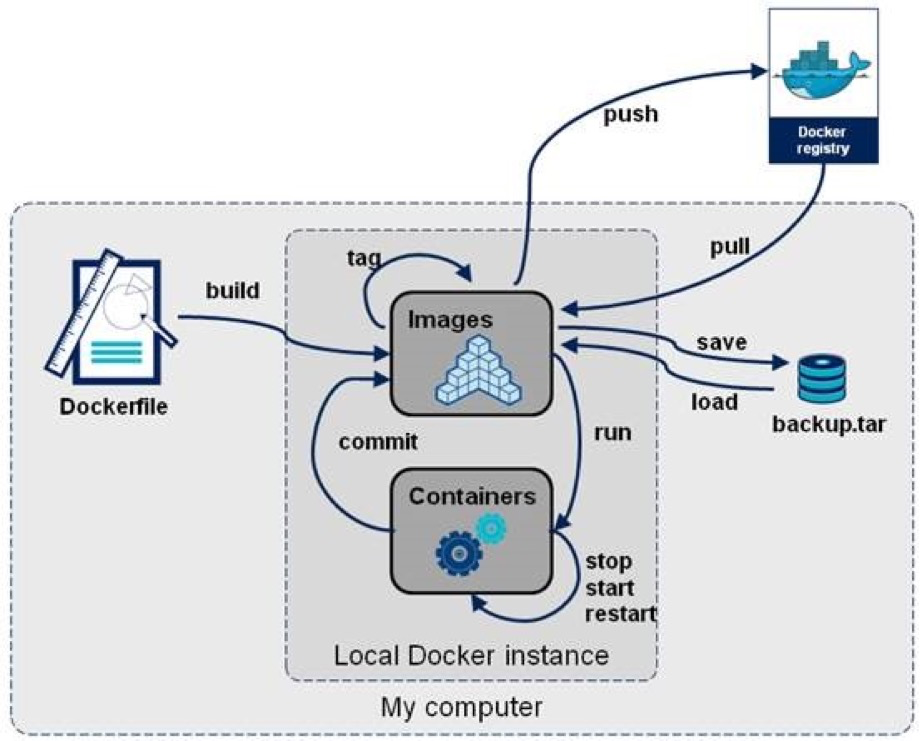

## Dockerfile命令
> 官网介绍：https://docs.docker.com/engine/reference/builder/

1. FROM

   `FROM <image>:<tag>`

    用于设置基础镜像，一般是Dockerfile的第一句。如果没有指定tag，则默认tag是latest。
2. MAINTAINER

   `MAINTAINER <name>`

   用来指定维护者的姓名和联系方式。
3. RUN

   `RUN <command> 或 RUN ["executable","param1","param2"]`

   每条 RUN 指令将在当前镜像基础上执行指定命令，并提交为新的镜像。
4. ADD

   `ADD <src> <dest>`

   将文件复制到文件：src是相对被构建的源目录（执行docker build命令的当前目录）的相对路径，可以是文件或目录的路径，也可以是一个远程的文件 url，dest是容器中的绝对路径。

5. COPY

   `COPY <src> <dest>`

   复制本地主机的src到容器中的dest,与ADD指令差不多

6. ENTRYPOINT

   ```bash
   ENTRYPOINT ["executable","param1","param2"] ：推荐使用的exec形式
   ENTRYPOINT command param1 param2 ：shell 形式
   ```

   配置容器启动后执行的命令，并且不可被 docker run 提供的参数覆盖。一个 Dockerfile 中只能有一个 ENTRYPOINT，如果有多个，则最后一个生效。

7. CMD
   ```bash
   CMD ["executable","param1","param2"] 使用exec执行，推荐方式；
   CMD command param1 param2 在/bin/sh 中执行，提供给需要交互的应用；
   CMD ["param1","param2"]提供给ENTRYPOINT 的默认参数；
   ```

   指定启动容器时执行的命令，每个 Dockerfile 只能有一条 CMD 命令。如果指定了多条命令，只有最后一条会被执行。如果用户启动容器时候指定了运行的命令，则会覆盖掉 CMD 指定的命令。

8. WORKDIR

   `WORKDIR /path/to/workdir`

   为后续的 RUN、CMD、ENTRYPOINT 指令配置工作目录。可以使用多个 WORKDIR 指令，后续命令如果参数是相对路径，则会基于之前命令指定的路径。例如：
   WORKDIR /a
   WORKDIR b
   WORKDIR c
   RUN pwd
   则最终路径为 /a/b/c 。

9. EXPOSE

   `EXPOSE <port> [<port>...]`

   告诉 Docker 服务端容器暴露的端口号，供互联系统使用。例如：EXPOSE 8080 3000，开放 8080 和 3000 端口。

10. ENV

    `ENV <key> <value>`
    指定一个环境变量，会被后续 RUN 指令使用，并在容器运行时保持。

11. VOLUME

    `VOLUME ["/data"]`

    创建一个可以从本地主机或其他容器挂载的挂载点，一般用来存放数据库和需要保持的数据等。

12. USER

    `USER <UID/Username>`

    为容器内指定 CMD RUN ENTRYPOINT 命令运行时的用户名或UID。

## Docker常用命令
> 官网介绍：https://docs.docker.com/engine/reference/commandline/docker/

### 镜像相关
1. 查看本地仓库的镜像：`docker images`
2. 拉取远程仓库镜像：`docker pull REPOSITORY:TAG`
3. 本地镜像打标记：
`docker tag IMAGE[:TAG] [REGISTRYHOST/][USERNAME/]NAME[:TAG]`
4. 使用Dockerfile构建镜像: `docker build -t REPOSITORY:TAG .`
> .点表示当前目录，默认会找当前目录下的Dockerfile进行构建，也可以通过`-f`指定Dockerfile：`docker build -f /path/Dockerfile -t REPOSITORY:TAG .`
5. 将本地镜像推送到远程仓库：`docker push REPOSITORY:TAG`
> 一般需要三步：
> A. 先将已有镜像打标签:`docker tag IMAGE_ID REPOSITORY:TAG` 需要tag为远程的仓库地址
> B. 登录远程仓库：`docker login –username=USERNAME REPOSITORY_REGOIN`
> C. 推送镜像到远程仓库：`docker push REPOSITORY:TAG`
>
> 比如将hello-docker:v1推送到docker hub库：
> docker push hub.docker.com/r/bebee/demo/hello-docker:v1
> docker镜像库：
> docker hub：https://hub.docker.com
> 网易云镜像中心：https://c.163yun.com/hub#/m/home/
6. 删除镜像：`docker rmi IMAGE_ID/ REPOSITORY:TAG`
> 强制删除：`docker rmi -f IMAGE_ID`
7. 删除untagged images：`docker rmi $(docker images | grep "^<none>" | awk "{print $3}")`
8. 删除全部image：`docker rmi $(docker images -q)`
9. 删除所有不使用的镜像：`docker image prune --force --all` 或 `docker image prune -f -a`

镜像操作流程示意图：


### 容器相关
1. 查看正在运行的容器：`docker ps`
2. 列出所有容器ID：`docker ps -aq`
3. 查看正在运行容器的日志：`docker logs -f CONTAINER_ID`
4. 列出所有容器：`docker container list`
5. 停止容器：`docker stop CONTAINER_ID`
> 停止所有的container：`docker stop $(docker ps -a -q) `
6. 删除容器：`docker rm CONTAINER_ID`
> 删除所有container：`docker rm $(docker ps -a -q)`
7. 从容器到宿主机复制：`docker cp CONTAINER:SRC_PATH DEST_PATH`
8. 从宿主机到容器复制：`docker cp SRC_PATH CONTAINER:DEST_PATH`
9. 删除所有停止的容器：`docker container prune`
10. 停止/启动/杀死/重启一个容器：`docker stop/start/kill/restart CONTAINER_ID/CONTAINER_NAME`
11. 进入容器：`docker exec -it CONTAINER_ID /bin/bash`
> docker exec ：在运行的容器中执行命令
> -d :分离模式: 在后台运行
> -i :即使没有附加也保持STDIN（标准输入） 打开,以交互运行容器，通常与 -t 同时使用；
> -t: 为容器重新分配一个伪输入终端，通常与 -i 同时使用；
12. 运行容器：`docker run [OPTIONS] IMAGE [COMMAND] [ARG...]`
> OPTIONS说明：
>	-a stdin: 指定标准输入输出内容类型，可选 STDIN/STDOUT/STDERR 三项；
>	-d: 后台运行容器，并返回容器ID；
>	-i: 以交互模式运行容器，通常与 -t 同时使用；
>	-P: 随机端口映射，容器内部端口随机映射到主机的高端口
>	-p: 指定端口映射，格式为：主机(宿主)端口:容器端口
>	-t: 为容器重新分配一个伪输入终端，通常与 -i 同时使用；
>	--name="nginx-lb": 为容器指定一个名称；
>	--dns 8.8.8.8: 指定容器使用的DNS服务器，默认和宿主一致；
>	--dns-search example.com: 指定容器DNS搜索域名，默认和宿主一致；
>	-h "mars": 指定容器的hostname；
>	-e username="ritchie": 设置环境变量；
>	--env-file=[]: 从指定文件读入环境变量；
>	--cpuset="0-2" or --cpuset="0,1,2": 绑定容器到指定CPU运行；
>	-m :设置容器使用内存最大值；
>	--net="bridge": 指定容器的网络连接类型，支持 bridge/host/none/container: 四种类型；
>	--link=[]: 添加链接到另一个容器；
>	--expose=[]: 开放一个端口或一组端口；
>	--volume , -v: 绑定一个卷
