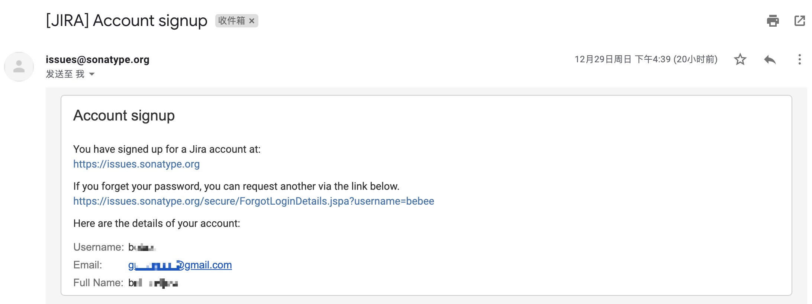
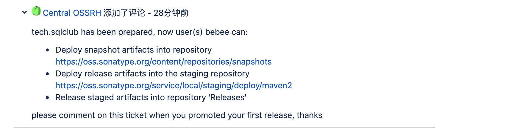
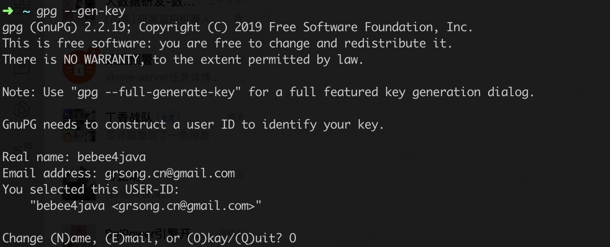
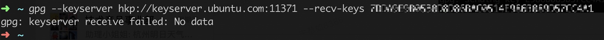
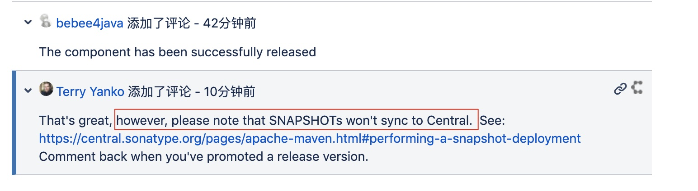

## 为什么写这篇文章
&emsp;&emsp;maven是java世界最流行的构建工具，做java的程序员应该没少使用maven中央仓库中的各种jar包，方便解决了工作中很多问题，提高了编码效率。程序员界有个编程原则就是：不要重复造轮子，所以工作中时常会抽取出很多实用的工具类、包等等。但是咱们也不能总是只取不予，应该懂得奉献，当你写好了一个十分好用的jar包，想贡献出去给大家使用的时候，应该怎么做呢？方法就是发布到maven的中央仓库，别人就可以通过maven依赖引用。不过这个发布过程，还是比较复杂的，本文就来详细说下如何发布自己的jar包到maven的中央仓库。
## 发布到中央仓库的好处
&emsp;&emsp;首先，作为一个java从业者，对天天在用的东西，做一个深入的了解，学会发布一个项目到中央仓库。对于我来讲，往maven发布自己的项目，开始有了利用下班时间好好写点开源代码学习和装逼的冲动。其次前面说到程序绝对不要重复造轮子，我在做开源项目[SQLPower](https://github.com/bebee4java/sqlpower)和[SQLAlarm](https://github.com/bebee4java/sqlalarm)的时候有很多公用的util类需要抽取成common模块，比较好的做法就是新建一个[common-utils](https://github.com/bebee4java/common-utils)项目，把所有公共的代码放在这项目中，然后发布到maven仓库里。如此一来另外两个项目就都可以通过maven依赖使用了。这样既方便了自己也往maven仓库中贡献了自己的代码，有可能别人通过你的项目也能提供效率。利人利己的事情还是很值得大家去尝试实践的。
## 发布流程
&emsp;&emsp;在发布前,您需要有自己的项目主页并开源的代码,您可以使用GitHub或者gitlab,下面的内容以GitHub为例。
### 注册 sonatype的Jira帐号
注册地址: https://issues.sonatype.org/secure/Signup!default.jspa

注册很简单,重要的是邮箱地址一定要正确,issue有任何变动都会通过邮件通知.
> 这里要着重说明一下: Username字段一定要使用英文+数字,一定不要使用中文!!!否则官方无法分配权限给你，会让你另行注册。
注册完成后你会收到官方给你的一份邮件：


### 登录Jira
注册完成后登陆: https://issues.sonatype.org/login.jsp
### 创建一个 Issue
> 通过【Create】按钮创建

> Project选择【Community Support - Open Source Project Repository Hosting (OSSRH)】
> Issue Type: 选择【New Project】
> Summary和Description: 自己填,注意要用英文
> Group Id: 这个必须要注意,如果你用的是GitHub,一定要是 com.github.你的github用户名,例如我的项目地址是:https://github.com/bebee4java/common-utils, 那我的groupId就是com.github.bebee4java, 当然也可以使用 GitHub的Page的域名 io.github.你的github用户名. 如果你有自己的域名和项目地址也可以,官方人员会询问你是否有这个域名的所有权.在你项目的pom里一定要使用这个groupId,最好包路径也使用.
> Project URL: 是你的项目地址
> SCM url: 是你的项目git地址
> Username(s): 可以不用填,这是能辅助你提交项目的合作人的帐号,前提是他也得在这个Jira注册
> 其他使用默认值就行了

创建好Issue后就等待官方回复吧。这个需要一段时间的等待，运气好的话很快就会有工作人员回复你。

这边我使用自己的域名作为项目的Group Id。然后工作人员给我回复了这么一个问题：

Central OSSRH 问你，这个域名是你的么，怎么证明这个域名是你的呢？他给了你两种解决方法。
1. 在域名解析中加上一个Txt记录，指向你发布的这个Issues(他称作JIRA ticket:)。（最快）
2. 设置重定向到您的Github页面（如果尚不存在）

所以，我选择了第一种方式，在dns里加条txt记录：

然后你就可以继续等待他的回复了......看到他给你这么回复：

说明你的问题被解决了：

审批通过在你申请的邮件箱中也会收到通过的邮件。

### 配置gpg加密jar包上传到构件仓库里面
1. 安装gpg: Mac直接在控制台`brew install gpg`即可.
> Windows 系统，可以下载 Gpg4win 软件来生成密钥对。
> 下载地址：https://www.gpg4win.org/download.html
> 查看是否安装成功: gpg --version
2. 命令行生成生成秘钥: `gpg --gen-key`
按提示输入名字， 如：bebee4java，邮箱grsong.cn@gmail,com，然后选择(O)kay, 输入：o

然后要求输入密码Passphase（输入两次），相当于密钥库密码，不要忘记。

到此密钥就生成成功了。
3. 查看公钥: `gpg --list-keys`

在框选的位置，会面需要用到。
4. 将公钥发布到 PGP 密钥服务器: `gpg --keyserver hkp://keyserver.ubuntu.com:11371 --send-keys 你的公钥`

5. 查询是否上报成功: `gpg --keyserver hkp://keyserver.ubuntu.com:11371 --recv-keys 你的公钥`
如果出现下面，别急再试一次就ok了：

输出下面信息说明发布成功了：


### 配置maven setting.xml
```xml
<servers>
    <server>
        <id>sonatype-nexus-snapshots</id>
        <username>sonatype用户名</username>
        <password>sonatype密码</password>
    </server>
    <server>
        <id>sonatype-nexus-staging</id>
        <username>sonatype用户名</username>
        <password>sonatype密码</password>
    </server>
</servers>

...

<profiles>
    <profile>
        <id>nexus-ossrh</id>
        <activation>
            <activeByDefault>true</activeByDefault>
        </activation>

        <properties>
            <gpg.executable>gpg</gpg.executable>
            <gpg.passphrase>密钥的密码</gpg.passphrase>
        </properties>
    </profile>
</profiles>
```
> server的id随意填写，只要和项目的pom.xml里面对应就行了。

### 配置项目pom.xml
```xml
<name>common utils</name>
<url>https://github.com/bebee4java/common-utils</url>
<description>
    A common util library for the sqlclub projects
</description>
<licenses>
    <license>
        <name>Apache 2.0 License</name>
        <url>http://www.apache.org/licenses/LICENSE-2.0.html</url>
        <distribution>repo</distribution>
    </license>
</licenses>
<developers>
    <developer>
        <id>bebee4java</id>
        <name>songgongru</name>
        <email>grsong.cn@gmail.com</email>
    </developer>
</developers>
<scm>
    <connection>
        scm:git:git@github.com:bebee4java/common-utils.git
    </connection>
    <developerConnection>
        scm:git:git@github.com:bebee4java/common-utils.git
    </developerConnection>
    <url>https://github.com/bebee4java/common-utils</url>
</scm>
<issueManagement>
    <url>https://github.com/bebee4java/common-utils/issues</url>
</issueManagement>
<profiles>
  <profile>
    <id>release-sign-artifacts</id>
    <build>
        <plugins>
            <!-- GPG -->
            <plugin>
                <groupId>org.apache.maven.plugins</groupId>
                <artifactId>maven-gpg-plugin</artifactId>
                <version>1.6</version>
                <executions>
                    <execution>
                        <phase>verify</phase>
                        <goals>
                            <goal>sign</goal>
                        </goals>
                    </execution>
                </executions>
            </plugin>
        </plugins>
    </build>
    <distributionManagement>
        <snapshotRepository>
            <id>sonatype-nexus-snapshots</id>
            <url>https://oss.sonatype.org/content/repositories/snapshots/</url>
        </snapshotRepository>
        <repository>
            <id>sonatype-nexus-staging</id>
            <url>https://oss.sonatype.org/service/local/staging/deploy/maven2/</url>
        </repository>
    </distributionManagement>
  </profile>
</profiles>
<build>
   <plugins>
      <plugin>
         <groupId>org.sonatype.plugins</groupId>
         <artifactId>nexus-staging-maven-plugin</artifactId>
         <version>1.6.7</version>
         <extensions>true</extensions>
         <configuration>
            <serverId>sonatype-nexus-staging</serverId>
            <nexusUrl>https://oss.sonatype.org/</nexusUrl>
            <autoReleaseAfterClose>true</autoReleaseAfterClose>
         </configuration>
      </plugin>
   </plugins>
</build>
```
> 注意：distributionManagement->repository->id 要和maven setting.xml 中的保持一致。

### 上传构件到OSS中

```bash
mvn clean deploy -Prelease-sign-artifacts
```
> 如果出现错误：gpg: signing failed: Inappropriate ioctl for device
在~/.zshrc 文件里加入export GPG_TTY=$(tty)

打包过程中会让你输入PGP的密码：

出现下面上传的信息，说明你已经可以正常将jar包部署到 OSS 中。

注意：此时上传的构件并未正式发布到中央仓库中，只是部署到 OSS 中了，别人还不能够使用。

### 在OSS中发布构建
&emsp;&emsp;地址：https://oss.sonatype.org/#stagingRepositories 需要使用之前注册的sonatype账号登录。

&emsp;&emsp;用你的SonaType的账号密码进行登陆后，点击左边的Staging Repositories然后根据所写的Group Id进行查询。如果在Staging Repositories中查找不到你的项目，但是在[Nexus公有库](https://oss.sonatype.org/index.html)中是可以查找到你的项目的话。那么这个问题可以忽略，因为这个是nexus-staging-maven-plugin插件中autoReleaseAfterClose自动设置为了True，所以就自动给close->release->drop三步，相当于自动给你做了。所以等待两个小时就会在中央仓库查找到了。


### 通知Sonatype构件已成功发布
&emsp;&emsp;通知Sonatype构件已成功发布，在之前创建的Issue中回复一条`The component has been successfully released`通知工作人员为需要发布的构件做审批，发布后会关闭该Issue。

**遇到的坑：**

&emsp;&emsp;当第一次进行上传的时候，version不要写成SNAPSHOT的，如果你写成SNAPSHOT版本的话，那么Sonartype管理员会回复你下面一段话：

大概意思是在第一次的时候不能上传SNAPSHOT只有第一次成功了以后才可上传。

解决方法：修改version重新deploy。很快管理员就回复同步已经开启：

看到整个同步过程需要2个小时左右，还是挺慢的😂......

## 检查同步是否成功
&emsp;&emsp;除了通过 [search.maven.org](https://search.maven.org/) 检查同步是否成功之外，查询[mvnrepository](https://mvnrepository.com/search?q=tech.sqlclub)也是常用的搜索方式。不过，值得一提的是，mvnrepository 相较于 search.maven.org 同步会更慢点，原因是 mvnrepository 引用了 central.maven.org 仓库。而 `central.maven.org == repo1.maven.org`，两个域名对应的 IP 是一样的，而这个 repo1.maven.org 就是默认的 Maven central repository，也就是 search.maven.org 的仓库。所以，你可以在以下两个仓库看到发布包：
http://central.maven.org/maven2/tech/sqlclub/
http://repo1.maven.org/maven2/tech/sqlclub/

&emsp;&emsp;据我实际测试发现，大概release之后不超过20分钟，就可以在
https://repo.maven.apache.org/maven2/ 这里查看到了，
只要这里有了，别人就可以依赖你提供的这个jar了。

## 以后发布过程
&emsp;&emsp;第一次提交才这么麻烦,以后提交只用重复maven发布,当然需要等待大概2小时的时间。
如果要发布新的项目,在使用相同GroupId的情况下,与上面的过程一样。只有使用不同的GroupId的时候,才会需要再去提交Issue申请。
&emsp;&emsp;当然如果你没有换电脑的话 GPG 的过程只需要一次就行。
